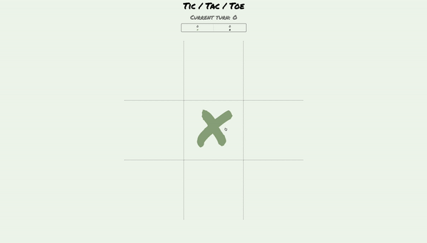

# TicTacToe Game (Project 1)

### Link to game: 
https://carterdeacon.github.io/tictactoe/ 

## File Overview 
`index.html`
- contains header, scoreboard to track score between games, 9 divs which come together to display board and modal conent (hidden by default).

`game.js`
- contains boardArray to track player input along side webpage displayed, functions to allow gameplay, win validation and score tracking.

`style.css`
- contains all CSS styling for page displayed as well as modal.

## Overview
Utilises event listeners on Tic Tac Toe board and play again button.

`handleClick` - handles player input
Alternating click using odd/even numbers to determine player turn and process player input to set board/square to display X or O respectively. 

`checkWin` - checks board for win conditions after each player turn
Utilises if statements and a nested for loop to check boardArray (containing all user inputs up to point) and confirm if X or O has won. 

`showModal` - displays winner and allows users to play again.
Hidden by default and only run if a user wins via checkWin or if the game ends in a draw.

`handleDumbCounter` - handles repeat inputs
Iterates through a counter for each time a player clicks on a square that has already been played on the board and delivers a (snarky) message accordingly. 

`handleReset` - resets board to play game again
Play again button shown in the modal. Resets board to be empty as well as board array and resets other changes made during gameplay (textContent, currentPlayer)

### Externals
- animate.css
- Permanent Marker font